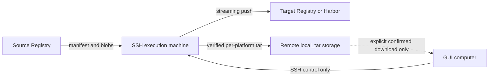

# docker-image-saver (`dia`)

[简体中文](README.zh-CN.md)

`dia` exports Docker/OCI images, synchronizes registries, and manages Harbor without requiring a Docker daemon. It is distributed as one static executable with CLI, terminal wizard, and loopback web GUI modes.

## Core guarantees

- **No Docker dependency:** Registry HTTP API V2 is implemented directly with Go `net/http`.
- **No required external runtime:** the native engine works when Docker, Podman, containerd, and `skopeo` are all absent.
- **Streaming archives:** layers are streamed into final docker-load tar files without intermediate layer files.
- **Verified output:** manifest, config, compressed blob, uncompressed `diff_id`, tar structure, and repository metadata are validated before an archive replaces the final file.
- **Platform-safe exports:** multi-platform images produce one tar per `os/arch[/variant]` plus a `*_platforms.json` index.
- **Cross-platform controller:** Linux, macOS, Windows, and Termux builds are produced by CI.
- **Remote data plane:** registry synchronization and remote `local_tar` jobs run on a selected Linux/macOS SSH execution machine. Image bytes do not transit the GUI computer.

## Modes

### Terminal wizard

No arguments starts the guided wizard:

```bash
dia
```

It asks for the image, output, optional proxy/authentication, inspects the manifest list, and accepts selections such as `all`, `1,2`, or `1,3-`.

### CLI

```bash
dia --image alpine:latest --arch 1 --output alpine.tar
dia pull alpine:latest alpine.tar --arch 1
dia save nginx:latest --proxy socks5h://127.0.0.1:1080
```

If `--arch` is omitted, all available platforms are exported separately.

### Local web GUI

```bash
dia gui
dia --gui
dia gui --no-browser
```

The GUI binds only to `127.0.0.1` on a random port. A random launch token is exchanged for an HttpOnly, SameSite cookie; Host, Origin, and loopback checks protect the local control API. Running with no arguments still starts the terminal wizard.

The same GUI contains:

- persistent Registry/Harbor profiles and multiple accounts
- persistent SSH execution machines and a remembered default machine
- editable, persistent image lists
- Registry-to-Registry synchronization
- remote `local_tar` archive jobs
- direct or SSH-routed Harbor management with an explicit access-path selector
- remote archive browsing and explicit on-demand download/drag-out
- the original single-image local exporter

See [Remote management](docs/REMOTE_MANAGEMENT.md) and [Security model](docs/SECURITY.md).

## Remote synchronization

Every synchronization job selects an SSH execution machine. A small `dia remote-agent` process is started over SSH stdio for that operation; it does not listen on a TCP port.



The remote host does **not** need Docker. It also does not need `skopeo`; released `dia` binaries can bootstrap the matching remote agent after checksum verification.

Synchronization sources are Registry V2 references. `dia` deliberately does not inspect or copy images from the execution machine's local Docker daemon, so behavior is identical on hosts where Docker is not installed.

### Transfer engines

[`skopeo`](https://github.com/containers/skopeo) is an optional optimization, not a runtime requirement.

| Engine | Behavior |
|---|---|
| `auto` | Uses `skopeo` when it is installed and source/target routing and credentials are compatible. If the copy fails, retries with the native engine. |
| `native` | Always uses the built-in Registry V2 implementation. No external command or daemon. |
| `skopeo` | Requires `skopeo` on the execution machine. Errors are returned directly; no implicit fallback. |

`local_tar` always uses the native verified archive engine. It selects the writable candidate filesystem with the most available bytes unless an output root is explicitly configured.

### Image list format

```text
# blank lines and comments are ignored
team/api:v1
team/worker:v1
legacy/service:v2 -> archive/service:v2
```

The left side is resolved against the source Registry profile. The right side is resolved against the target profile. Without `->`, the same repository and tag are used at both ends.

For `local_tar`, the right side controls both the remote archive filename and the `RepoTags` loaded by Docker. A single-platform archive loads under that target name; multi-platform exports append `-<os>-<arch>[-<variant>]` to each tar filename and tag so the platforms remain distinct. Digest references are accepted on the source side; a `local_tar` target must use a tag because docker-load archives cannot represent a digest in `RepoTags`.

## Harbor operations

A saved profile with type `harbor` supports:

- health status
- list/create/delete projects
- list/delete repositories
- list/delete artifacts
- create/delete tags

Choose **Direct from this machine** to let the controller process call Harbor, or select a saved SSH execution machine to route the same operation through the remote agent. The saved profile's proxy is applied on the chosen machine. Credentials remain server-side in both modes, and destructive actions require confirmation in the UI.

## Proxy support

Environment variables:

- `HTTP_PROXY` / `http_proxy`
- `HTTPS_PROXY` / `https_proxy`
- `ALL_PROXY` / `all_proxy`
- `NO_PROXY` / `no_proxy`

Explicit examples:

```bash
dia save alpine:latest --proxy http://127.0.0.1:7890
dia save alpine:latest --proxy socks5://127.0.0.1:7897
dia save alpine:latest --proxy socks5h://127.0.0.1:7897
```

`socks5://` resolves names locally. `socks5h://` sends hostnames through the proxy and avoids local DNS dependency.
`NO_PROXY` is honored for environment-derived HTTP, HTTPS, and ALL proxy routing. An explicit `--proxy` is an intentional per-request override.

## Archive output and loading

Each successful export reports the absolute path, platform, size, platform index, and exact load command:

```bash
docker load -i /absolute/path/image_linux_amd64.tar
docker image ls
```

The tar contains Docker's legacy load structure:

- `manifest.json`
- `repositories`
- image config JSON
- layer directories with `layer.tar`, `VERSION`, and `json`

The archive is written to a temporary `.part` file, validated, and atomically replaces the final path only on success.

## Integrity validation

Validation is enabled by default and cannot be silently skipped:

1. Manifest responses are checked against digest headers or parent descriptors.
2. Config and layer blobs are checked against descriptor digest algorithm and size.
3. Decompressed layers are checked against config `rootfs.diff_ids` using each declared digest algorithm.
4. The completed tar is reopened and its required files, config names, layers, tags, and `repositories` mappings are checked.
5. Only a validated temporary archive replaces the requested output.

## Configuration and secrets

GUI records are stored under the OS user configuration directory in `dia/`:

- `config.json`: endpoints, usernames, SSH metadata, image lists; no passwords
- `secrets.enc`: AES-256-GCM encrypted Registry and SSH secrets
- `master.key`: randomly generated local key, mode `0600` where supported

Overrides:

- `DIA_CONFIG_DIR`: alternate configuration directory
- `DIA_CONFIG_KEY`: base64-encoded 32-byte key supplied externally; set it before the first secret is stored
- `DIA_REGISTRY_USERNAME` / `DIA_REGISTRY_PASSWORD`: transient CLI/GUI startup credentials

The browser receives only `has_secret` flags. Saved passwords are resolved server-side and are never serialized into HTML bootstrap data, task snapshots, command lines, or logs.
The terminal wizard disables echo while reading a password from a real terminal; piped stdin remains available for automation.

## Install

Release assets are named `dia_<os>_<arch>` and `dia_windows_<arch>.exe`. Download them from [GitHub Releases](https://github.com/lovitus/docker-image-saver/releases).

Termux uses the normal Linux binary, for example:

```bash
chmod +x dia_linux_arm64
./dia_linux_arm64
```

No root access or APK packaging is required.

## Development gate

Local work is limited to source inspection and syntax/format checks. Unit tests, integration tests, race detection, `go vet`, cross-compilation, packaging, checksums, and release publication run only in GitHub Actions. Every change reaches `main` through a pull request after the required `quality` and `cross-build` checks pass.

See [CONTRIBUTING.md](CONTRIBUTING.md) and the mandatory repository policy in [AGENTS.md](AGENTS.md).

## Release automation

Branch pushes and pull requests run [.github/workflows/ci.yml](.github/workflows/ci.yml). Pushing a changelog-backed `v*` tag runs [.github/workflows/release.yml](.github/workflows/release.yml), which:

1. enforces formatting, GUI syntax, and reproducible modules
2. runs `go vet`, race-enabled tests, and shuffled-order tests
3. cross-compiles every active `linux`, `darwin`, and `windows` target reported by `go tool dist list`
4. creates SHA-256 checksums
5. publishes workflow-built artifacts and version notes to the GitHub Release

Locally built binaries are never accepted as release assets.

## Limitations

- SSH execution machines currently support Linux and macOS. Windows is supported as the GUI/controller.
- Browser drag-out uses Chromium/Edge `DownloadURL`; other browsers should use the confirmed Download button.
- Native Registry synchronization supports Docker Distribution/OCI Registry V2 behavior. Vendor-specific replication policies remain managed by that registry.
- Remote synchronization reads Registry V2 sources, not images stored only in a local Docker daemon.
- Secrets encrypted with the default adjacent `master.key` are protected from accidental plaintext disclosure, not from an attacker who already has full access to the same OS account. See [Security model](docs/SECURITY.md).
